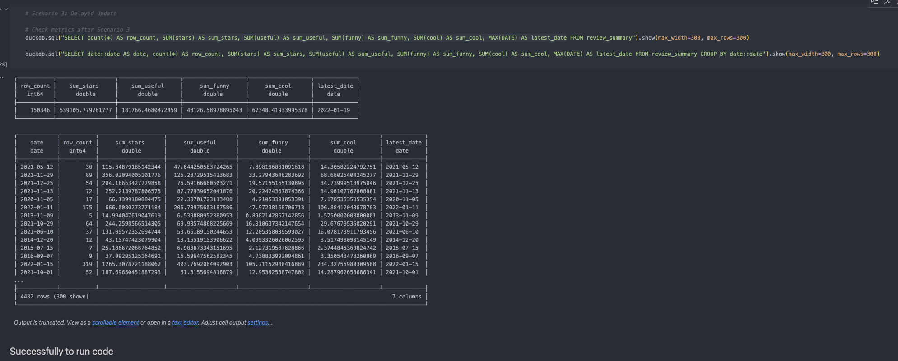

# Yelp Json Pipeline

This repository contains my solutions. The test consists of three case studies, focusing on SQL querying, Python data replication, and Python data export.

## Table of Contents
1. [Case Study 1: SQL Query](#case-study-1-sql-query)
2. [Case Study 2: Python Data Replication](#case-study-2-python-data-replication)
3. [Case Study 3: Python Data Export](#case-study-3-python-data-export)

## Case Study 1: SQL Query

### Objective
Work with JSON files containing business review data using DuckDB's Python API and SQL queries.

### Solutions

#### **Please Find The solutions on case_study_1.ipynb or case_study_1.py**

1. **DDL Query for Table Creation:**
   ```sql
       CREATE TABLE review_summary (
            business_id VARCHAR PRIMARY KEY,
            stars DOUBLE,
            useful DOUBLE,
            funny DOUBLE,
            cool DOUBLE,
            date date,
            count_review INT
        );
   ```

2. **Initial Data Load Query:**
   ```sql
        INSERT INTO review_summary  (
           SELECT business_id, AVG(stars) AS avg_stars, AVG(useful) AS avg_useful, AVG(funny) AS avg_funny, AVG(cool) AS avg_cool, MAX(DATE) AS latest_date, COUNT(business_id) AS count_review
           FROM review_temp 
           WHERE date BETWEEN '2018-01-01' AND '2019-01-01'
           GROUP BY business_id
           );
   ```

3. **Daily Update Query:**
   ```sql
    WITH aggregate_temp AS (
        SELECT business_id, AVG(stars) AS avg_stars, AVG(useful) AS avg_useful, AVG(funny) AS avg_funny, AVG(cool) AS avg_cool, MAX(DATE) AS latest_date, COUNT(business_id) AS count_review
        FROM review_temp_01_02 
        GROUP BY business_id)

        
        INSERT OR REPLACE INTO review_summary (
        SELECT  
        U.business_id,
        COALESCE(((T.count_review * T.avg_stars) + (U.count_review * U.avg_stars)) / (U.count_review + T.count_review), U.avg_stars) AS avg_stars,
        COALESCE(((T.count_review * T.avg_useful) + (U.count_review * U.avg_useful)) / (U.count_review + T.count_review), U.avg_useful) AS avg_useful,
        COALESCE(((T.count_review * T.avg_funny) + (U.count_review * U.avg_funny)) / (U.count_review + T.count_review), U.avg_funny) AS avg_funny,
        COALESCE(((T.count_review * T.avg_cool) + (U.count_review * U.avg_cool)) / (U.count_review + T.count_review), U.avg_cool) AS avg_cool,
        GREATEST(U.latest_date, T.latest_date) as latest_date,
        COALESCE(T.count_review + U.count_review, U.count_review) AS count_review
        FROM aggregate_temp U
        LEFT JOIN review_summary T ON U.business_id = T.business_id);
   ```

### Results
- **Initial Load:**
  - Summary Metrics: 
  - Detailed Metrics per Date: 
  

- **First Update (2 February 2018):**
  - Summary Metrics: 
  - Detailed Metrics per Date: 
  

- **Delayed Update (14 February 2018):**
  - Summary Metrics: 
  - Detailed Metrics per Date: 
  

## Case Study 2: Python Data Replication

### Objective
Create a Python function to read JSON files, convert data to tabular format, and write to Parquet files without using SQL queries.

### Solution
```python
python case_study_2.py
```

### Performance Metrics
Using google collab got the result
- Runtime & Memory Consumption:


### Parquet File Details
- File Size: 3,05 GB
- Schema:
  

### Data Comparison Metrics
- JSON Data:
 
- Parquet Data:
  

## Case Study 3: Python Data Export

### Objective
Aggregate data for a specific business ID and store results in Google Sheets, with daily update functionality.

### Solution
```python
python case_study_3.py
```

### Google Sheets Link
[Google Sheet Link](https://docs.google.com/spreadsheets/d/12acDhlAxP3tfd9zvyqKFMp7AEB3T8t0i3ZL-QpD7EXE/edit?usp=sharing)
https://docs.google.com/spreadsheets/d/12acDhlAxP3tfd9zvyqKFMp7AEB3T8t0i3ZL-QpD7EXE/edit?usp=sharing 


### Results
**Please Find My result in case_study_3.ipynb**

## Execution Environment
All Python code was executed in Google Colab to ensure consistency and My Own Laptop for development.

## Contact
For any questions or clarifications about these solutions, please contact Azhar
